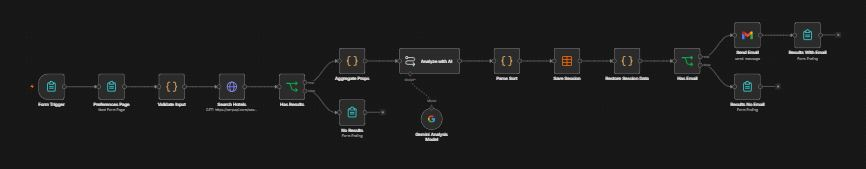
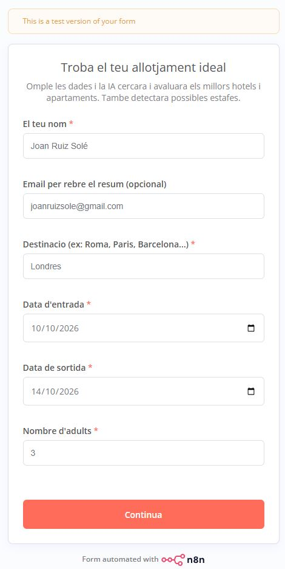
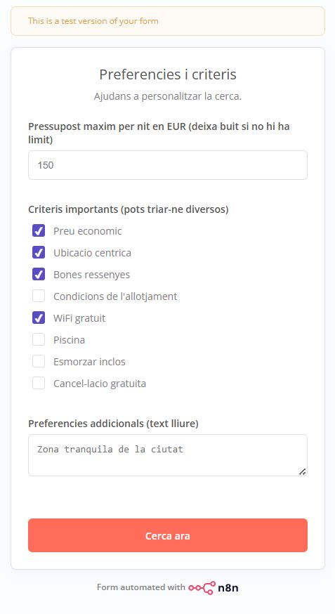
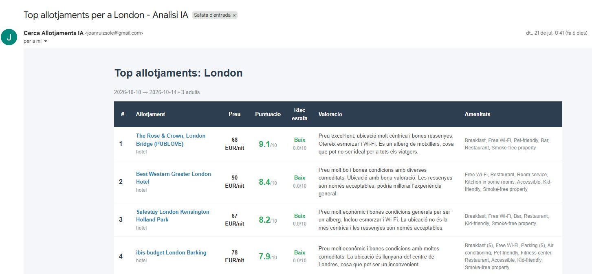
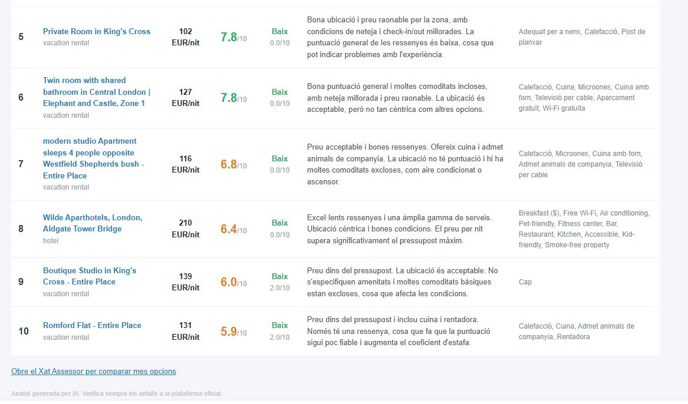
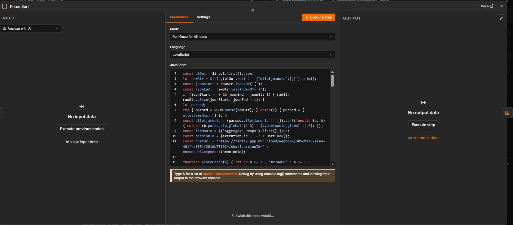

# 🏨 AI-Powered Accommodation Finder & Scam Detector

> **He construido un buscador de alojamientos con IA que analiza, puntúa y detecta posibles estafas en segundos.** 🏨🤖

La idea era clara: no quería solo buscar hoteles en un listado interminable. Quería una IA que evaluara las opciones según mis verdaderas prioridades y que actuara como filtro de seguridad si detectaba patrones sospechosos en precios o descripciones.

---

## 🏗️ Arquitectura del Sistema

He desplegado una arquitectura en **n8n** conectada a **Google Hotels (vía SerpAPI)**, **Gemini 2.5 Flash** y **Gmail** con el siguiente flujo arquitectónico de extremo a extremo:

---

## ⚙️ Funcionalidades Clave y Flujo de Datos

### 1. Formulario Nativo Multicanal e Ingesta
El usuario introduce destino, fechas y su presupuesto. Un código JS interno valida al instante las fechas y calcula automáticamente las pernoctaciones y variables necesarias para la búsqueda.

| Paso 1: Datos Básicos | Paso 2: Preferencias y Criterios |
| :---: | :---: |
|  |  |

### 2. Motor Algorítmico IA (Puntuación & Seguridad)
* **✅ Puntuación dinámica (0 al 10):** Adaptada 100% a los criterios del usuario (ubicación, precio, wifi, etc.), ponderando matemáticamente las variables en el prompt de la IA.
* **✅ "Coeficiente de estafa":** Calculado algorítmicamente si la oferta tiene precios sospechosamente bajos, valoraciones de 4.8 con apenas 15 reseñas o ausencia total de amenidades.

### 3. Generación de Interfaz sin Frontend y Entrega
Un nodo de código compila los datos procesados en una tabla HTML con estilos limpios y etiquetas de colores (*verde, naranja o rojo según el nivel de riesgo*) que se entrega directamente en pantalla y por email.

 

### 4. Lógica de Backend (Parsing & Sorting)
Detalle del procesamiento algorítmico en JavaScript dentro de n8n para estructurar la respuesta del LLM y maquetar la salida de datos:

---

## 📈 Evolución Continua y Aprendizaje Transversal

Quienes me conocéis sabéis que me gusta cruzar disciplinas: ingeniería informática, innovación, salud y deporte, e incluso economía y redes sociales.

Este verano estoy dedicando tiempo a dominar la automatización de procesos (**BPA**). Es genial comparar la evolución técnica entre mis últimos desarrollos:

| Aspecto Técnico | 🔸 Proyecto 1: ERP & Facturas | 🔸 Proyecto 2: Buscador IA & Scam Detector |
| :--- | :--- | :--- |
| **Trigger (Entrada)** | Gmail (Email entrante asíncrono) | Formulario Web nativo en tiempo real |
| **Motor de Análisis** | Parsing inteligente + Fórmulas | SerpAPI & Google Gemini IA |
| **Almacenamiento / Salida** | Google Sheets ➔ Looker Studio (Dashboard BI) | Gmail ➔ Custom HTML (Output visual & interactivo) |

Sigo aprendiendo sin prisa, con el objetivo de mantener mis habilidades actualizadas para el mercado del presente y del futuro. Espero que esto inspire a cualquier estudiante, autónomo o profesional a mantener una curiosidad incansable y a seguir aprendiendo día tras día, se comparta o no con el mundo. 💡

---

## 🔒 Nota sobre Privacidad y Código Fuente

> Por motivos de seguridad, privacidad y protección de infraestructura (*credenciales, endpoints y estructuración de datos*), he decidido no adjuntar el archivo bruto `.json` del flujo en este repositorio público. 
> 
> No obstante, es relevante señalar que en plataformas como **n8n**, toda la arquitectura visual que se muestra en las imágenes (*los nodos, el enrutamiento condicional y los scripts en JS/Python*) se compila, serializa y almacena de forma nativa en un archivo **JSON**. Este formato actúa como la verdadera columna vertebral y alternativa agnóstica de la herramienta, permitiendo tratar el *"no-code/low-code"* como código real que se puede versionar, replicar y auditar de manera profesional.

---

`#n8n` `#IA` `#Automation` `#SoftwareEngineering` `#Innovation` `#BPA`
